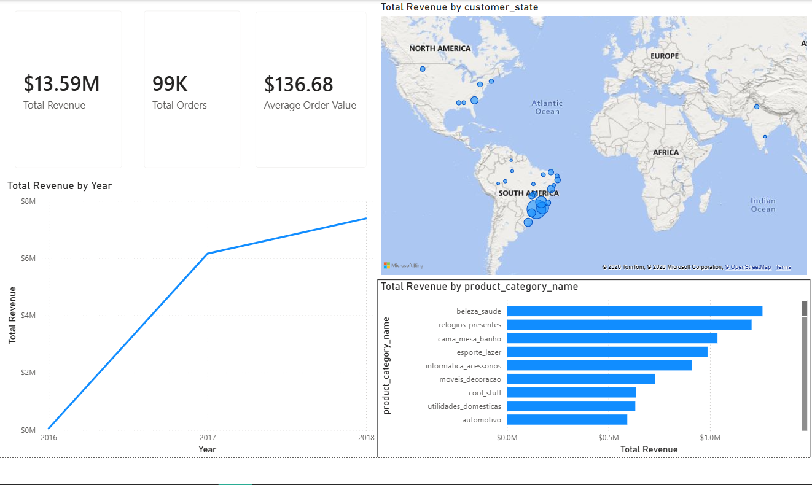

# 📊 E-Commerce Sales Performance & Operations Dashboard

An end-to-end business intelligence project analyzing retail performance across 99K+ transactions (~$13.59M in gross revenue). The project covers raw database ingestion, data cleaning, star-schema relational modeling, DAX measure engineering, and an interactive executive dashboard.

---

## 🖥️ Dashboard Overview

---

## 🛠️ Tech Stack & Tools
* **Database Engine:** MySQL Server 8.0
* **Data Modeling & BI:** Power BI Desktop, Power Query
* **Analytics Language:** SQL, DAX (Data Analysis Expressions)

---

## 🔍 Key Business Insights
* **Revenue Anchor:** The **Health & Beauty** (`beleza_saude`) category was the single largest revenue engine, generating over **$1.25M+** across 9,600+ items sold.
* **Regional Dominance:** The state of **São Paulo (SP)** accounted for over **$5.2M** in revenue—more than triple the second-highest state (Rio de Janeiro), highlighting heavy geographic dependency.
* **Payment Behavior:** Credit card transactions dominated payment volume ($12.54M), driven by installment usage and yielding the highest Average Transaction Value ($163.32).

---

## 🏗️ Architecture & Implementation
1. **Data Pipeline:** Ingested relational datasets into a local MySQL instance using optimized batch-loading scripts.
2. **Data Cleaning & Transformation:** Handled localized dot-separated timestamps, resolved empty delivery date logs for canceled/processing orders via Power Query.
3. **Data Modeling:** Structured a 1-to-many Star Schema linking Dimension tables (`customers`, `products`) to Fact/Transaction tables (`orders`, `order_items`, `order_payments`).
4. **DAX Measures:** Engineered core KPI calculations:
   * `Total Revenue = SUM(order_items[price])`
   * `Total Orders = DISTINCTCOUNT(orders[order_id])`
   * `Average Order Value = DIVIDE([Total Revenue], [Total Orders], 0)`

---

## 📁 Repository Structure
* `Data_Import_Scripts_.sql` - DDL and bulk ingestion queries.
* `Data_Cleaning_&_Core_KPI's.sql` - Data auditing, null handling, and SQL business logic.
* `dashboard_preview.png` - Full executive dashboard report canvas.
